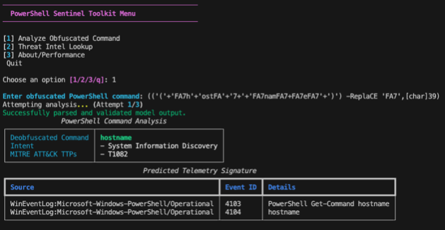
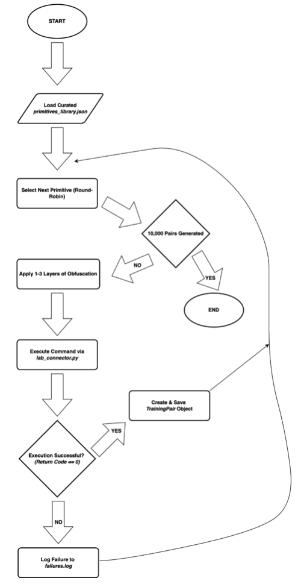

# LLM-driven PowerShell Analysis Assistant

An MSc dissertation project from University College London focused on fine-tuning a Large Language Model to automate the analysis of obfuscated PowerShell commands. This project demonstrates a novel, data-centric methodology for creating specialized AI tools for cybersecurity operations.

  

---

## The Problem: The Challenge of Obfuscated PowerShell

Modern attackers frequently use "Living Off the Land" (LOTL) techniques, abusing native tools like PowerShell to evade detection. They employ multiple, randomized layers of obfuscation (string manipulation, encoding, dynamic invocation) to hide malicious commands. This creates a "combinatorial explosion" of variations that break traditional signature-based security tools.

For a Security Operations Center (SOC), manually deconstructing these commands is a slow, error-prone, and specialized task that doesn't scale during a real incident. This project aimed to solve this problem by automating the analysis process.

## The Solution: A Data-Centric AI Assistant

This project proves that a data-centric approach can transform a general-purpose Large Language Model (LLM) into a reliable, specialized security tool. The core of this work is the **PowerShell-Sentinel Data Factory**, a custom MLOps pipeline built to solve the critical bottleneck of data scarcity.

The pipeline automates the generation of a high-fidelity dataset of over **9,550 unique and validated** obfuscated PowerShell command-to-telemetry pairs. This was achieved through an iterative engineering process:
1.  **Lab Architecture:** A controlled, multi-VM Azure lab with Active Directory, Windows Server, Splunk, and Sysmon was built to generate realistic, high-fidelity telemetry (Event IDs 4104, 4103, Sysmon EID 1 & 3, etc.).
2.  **Iterative Generation:** An initial randomized factory revealed profound dataset bias. It was re-engineered into a deterministic, AST-aware obfuscation engine to produce a diverse and balanced dataset, mitigating the initial flaws.
3.  **Model Fine-Tuning:** A `meta-llama/Llama-3-8B-Instruct` model was fine-tuned on this specialized dataset using QLoRA to teach it the complex task of deobfuscation and structured analysis.

  

---

## Performance: A Quantifiable Leap in Reliability and Accuracy

When evaluated on a diverse, locked test set, the final fine-tuned model demonstrated a profound improvement over a baseline model trained on a biased, lower-quality dataset. The data-centric approach was empirically validated.

| Metric | Baseline Model (on Diverse Test) | **Final Model (on Diverse Test)** | Improvement |
| :--- | :--- | :--- | :--- |
| **JSON Parse Success Rate** | 76.31% | **85.79%** | +9.48% |
| **Deobfuscation Accuracy** | 10.90% | **74.78%** | **+586%** |
| **Intent F1-Score (Macro)** | 9.92% | **69.48%** | **+599%** |
| **Telemetry F1-Score (Macro)**| 11.27% | **75.40%** | **+569%** |

#### Key Achievements:
*   ✔️ **Reliable for Automation:** Achieved an **85.79% JSON Parse Success Rate**, ensuring the model's output is structured and machine-readable for use in automated security pipelines (SOAR).
*   ✔️ **Accurate Forensic Prediction:** Reached a **75.40% Telemetry F1-Score**, proving the model can accurately predict the exact forensic evidence a command will leave behind on a compromised host.
*   ✔️ **Overcame "Cognitive Load":** The superior dataset enabled the model to handle complex semantic tasks (Intent Classification, Telemetry Prediction) while still adhering to a strict output format, solving a key challenge in fine-tuning LLMs.

---

## Tech Stack

*   **AI/ML:** Python, PyTorch, Hugging Face (Transformers, PEFT, TRL), QLoRA, Pydantic
*   **Cybersecurity & Labs:** PowerShell, Splunk, Sysmon, MITRE ATT&CK Framework
*   **Infrastructure:** Microsoft Azure (Virtual Machines, Virtual Networks), Windows Server, Active Directory, WinRM

## Full Dissertation

For a complete academic deep-dive into the methodology, data generation process, and model evaluation, the full dissertation is available here:

[`[PDF] LLM-driven PowerShell Analysis Assistant`](docs/dissertation.pdf)
